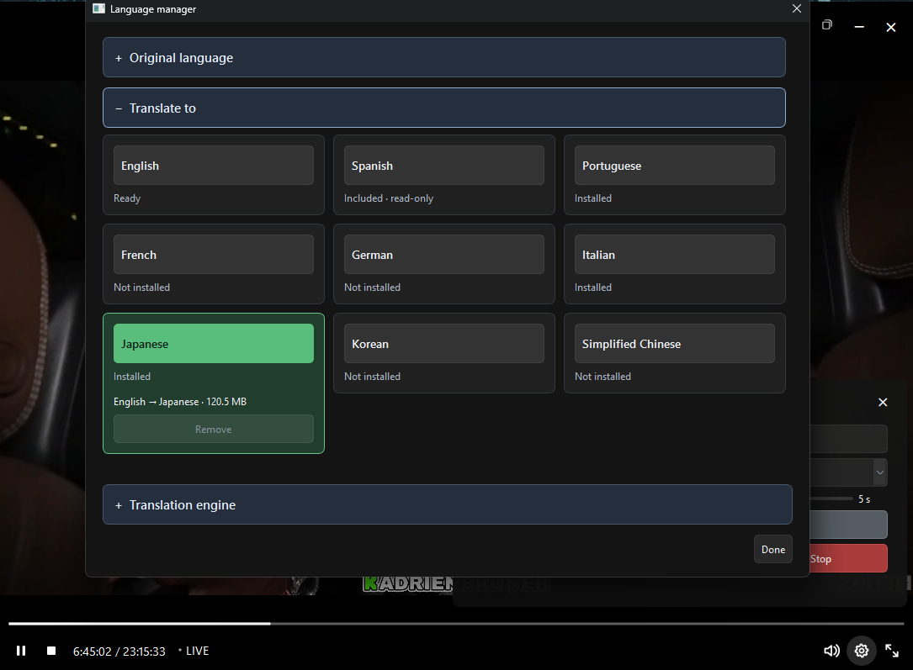

# Langbuffer

Langbuffer is a Windows desktop app that translates live streams with local speech recognition. It intentionally buffers a short, configurable amount of video and audio in RAM. Recognition and translation work on the incoming audio while the viewer's video and sound wait. This gives the translation nearby context and time to settle before a subtitle appears, instead of improvising a word-by-word translation as the scene plays. Once a subtitle is shown, its text stays fixed and aligned with the delayed playback.

Prerecorded YouTube videos have an inherent advantage: their content already exists before you watch, so subtitles can be prepared ahead of playback. A live stream does not provide the whole video in advance. Langbuffer uses a limited buffer to gain a small context window while keeping the experience near live. The delay is intentional; it does not guarantee perfect translation or synchronization, and media is not saved to disk.

## Screenshots


Live playback with Japanese subtitles. Japanese requires an optional language package.



The Language manager shows which packages are included, installed, or still available to download. The package status in this screenshot reflects one installation.

## Languages

Choose an input and an output language from **English, Spanish, Portuguese, French, German, Italian, Japanese, Korean, and Simplified Chinese**. English speech uses an English recognition model; other input languages share a multilingual recognition model. Translation between two non-English languages uses English as an intermediate step when needed.

The portable download includes English recognition and English → Spanish translation. Download other recognition models and translation packages from the in-app Language manager before using those combinations. The interface is available in English, Spanish, Portuguese, and French; English is used for other output languages.

## Download and run

Download **`Langbuffer-v0.1.1-beta.1-windows-x64.zip` from [Releases](https://github.com/sw413sg/langbuffer/releases)**, extract the entire archive to a writable folder, and open `Langbuffer/Start Langbuffer.cmd`. The portable package includes Python, the app's dependencies, the `small.en` English speech model, and English-to-Spanish translation. Additional speech models and language pairs can be downloaded in the app's **Language** manager.

GitHub's **Code → Download ZIP** contains source code only. It does not contain the Python runtime or models and is not the ready-to-run download.

When upgrading from Live Translate, close the old app. For a separate extraction, copy `LiveTranslate/data/preferences.json`, `LiveTranslate/data/models/`, and `LiveTranslate/data/language-packages/` to the corresponding paths under `Langbuffer/data/` to retain preferences and optional packages. The bundled English model and English-to-Spanish translation are already in the new archive.

The first public package targets Windows x64. It has been checked after extraction on the development machine; a clean Windows installation has not yet been tested.

## What it does

- Plays supported public streams from X, Twitch, Kick, and active YouTube live links, plus compatible public Facebook video links.
- Offers configurable playback delay, local speech recognition and translation, and subtitles synchronized to the delayed playback.
- Supports nine input and output languages through downloadable local packages. English recognition and English-to-Spanish translation are included in the portable download.
- Provides quality selection, pause, volume, subtitle appearance, a manual timing offset, and remote DVR where the source provides it.
- Keeps media buffers in RAM. It does not save audio, video, or transcripts; it stores preferences, installed models, and content-free session metrics.

Source availability and stream formats can change. Some advertised sources and formats have only synthetic coverage; see [supported sources and limits](Langbuffer/README.md) for details.

## Source code and licensing

The app's own code is licensed under [GPLv3](LICENSE). Bundled third-party components keep their respective licenses; see [third-party notices](Langbuffer/THIRD_PARTY.md).

This repository excludes the runtime, models, personal preferences, and session metrics. To build a portable archive from a complete local installation:

```powershell
.\Langbuffer\runtime\python.exe tools\build_release.py
```

The script writes the archive and its SHA-256 checksum to `dist/`. It omits local preferences, metrics, and optional downloaded packages.

To work from a source clone, install Python 3.12 x64 and `Langbuffer/requirements-lock.txt`. From `Langbuffer/`, set `PYTHONPATH=src` before running `python -m langbuffer`; install the needed models in the app's Language manager. The package catalog pins download revisions and checksums.

- [Usage, dependencies, and verification](Langbuffer/README.md)
